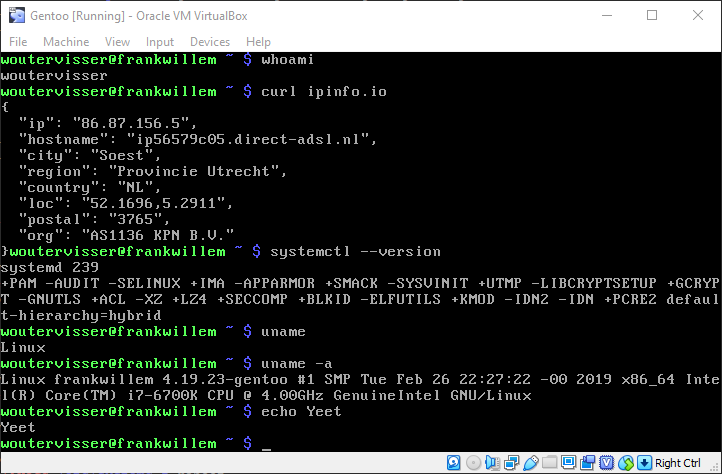

# Installatie

Laad de ISO in een virtuele machine en klik op enter om te starten.


## User setup

Met `passwd` passen we het root wachtwoord aan.
Via `useradd -m -G users woutervisser` voegen wij een nieuwe gerbuiker toe.
Met `passwd woutervisser` passen we het wachtwoord aan voor deze nieuwe gebruiker.


## SSH

Via `rc-service sshd start` starten we een SSH server zodat we via een fatsoenlijke terminal de installatie kunnen doen.


## Netwerk

Via `curl ipinfo.io` zien we dat het internet correct werkt, hier zijn dus geen verdere stappen voor nodig.


## Partities aanmaken

Met `parted -a optimal /dev/sda` started we het parted programma op de /dev/sda schijf.
We geven de schijf het GPT label via `mklabel gpt`.
Met `unit mib` geven we aan dat we met megabytes werken wanneer we een grote aangeven.

Hierna gebruiken we onderstaande commandos om een viertal partities aan te maken, namelijk grub, boot, swap en rootfs.


```parted
(parted) mkpart primary 1 3
(parted) name 1 grub
(parted) set 1 bios_grub on
(parted) mkpart primary 3 131
(parted) name 2 boot
(parted) mkpart primary 131 643
(parted) name 3 swap
(parted) mkpart primary 643 -1
(parted) name 4 rootfs
(parted) set 2 boot on
(parted) print
Model: ATA VBOX HARDDISK (scsi)
Disk /dev/sda: 20480MiB
Sector size (logical/physical): 512B/512B
Partition Table: gpt
Disk Flags:

Number  Start    End       Size      File system  Name    Flags
 1      1.00MiB  3.00MiB   2.00MiB                grub    bios_grub
 2      3.00MiB  131MiB    128MiB                 boot    boot, esp
 3      131MiB   643MiB    512MiB                 swap
 4      643MiB   20479MiB  19836MiB               rootfs
```

Uitendelijk sluiten we parted met het `quit` commando.


## Filesystems aanmaken

Met onderstaande commandos maken we alle partities aan en initializeren we de swap partitie.

```sh
mkfs.ext2 /dev/sda2  # Setup als ext2
mkfs.ext4 /dev/sda4  # Setup als ext4
mkswap /dev/sda3  # Setup als swap
swapon /dev/sda3  # Activeer swap
```

Uiteindelijk mouten we ons nieuwe rootfs met `mount /dev/sda4 /mnt/gentoo`


## Stage tarball downloaden

Ga naar de /mnt/gentoo map met `cd /mnt/gentoo`
Download de amd64-systemd stage tarball met `wget http://ftp.snt.utwente.nl/pub/os/linux/gentoo/releases/amd64/autobuilds/current-stage3-amd64-systemd/stage3-amd64-systemd-20190223.tar.bz2`
Als deze download klaar is pakken we de tarball uit met `tar xpf stage3-amd64-systemd-20190223.tar.bz2 --xattrs-include='*.*' --numeric-owner`


## Compile opties instellen

Met het commando `nproc` kijken we hoeveel cores we hebben, onthoud dit nummer.

Open het bestand `/etc/portage/make.conf` met een texteditor, wij gebruiken nano: `nano /mnt/gentoo/etc/portage/make.conf`
Nu we het bestand geopend hebben voegen we `MAKEOPTS="-j4"` toe, vervang `4` met het aantal cores dat `nproc` aangeeft.

Hierna selecteren we de http mirror van Universiteit Twente met `mirrorselect -i -o >> /mnt/gentoo/etc/portage/make.conf`


## Chrooting

```
# Setup ebuild repo
mkdir --parents /mnt/gentoo/etc/portage/repos.conf
cp /mnt/gentoo/usr/share/portage/config/repos.conf /mnt/gentoo/etc/portage/repos.conf/gentoo.conf

# Kopieer DNS informatie naar rootfs
cp --dereference /etc/resolv.conf /mnt/gentoo/etc/

# Mount vereiste filesystems
# -make-rslave is vereist voor systemd
mount --types proc /proc /mnt/gentoo/proc
mount --rbind /sys /mnt/gentoo/sys
mount --make-rslave /mnt/gentoo/sys
mount --rbind /dev /mnt/gentoo/dev
mount --make-rslave /mnt/gentoo/dev

# Ga naar nieuwe omgeving
chroot /mnt/gentoo /bin/bash
source /etc/profile
export PS1="(chroot) ${PS1}"

# Mount boot partitie
mount /dev/sda2 /boot
```


## Portage instellen

Met `emerge-webrsync` downloaden we de vereiste bestanden voor emerge.
Gebruik `eselect profile list` om alle opties te tonen, er staat een sterretje achter het huidige profiel.
We willen `default/linux/amd64/17.0/systemd (stable)` gebruiken, als het goed is staat deze al geselecteerd maar voor de zekerheid doen we `eselect profile set 25` (mogelijk moet je 25 vervangen door een ander nummer).

Met `emerge --update --deep --newuse @world` updaten we de @world van ons systeem. (Dit duurt tien jaar, dus je kan wel even een filmpie pakken)


## Regio specifieke instellingen + tijdzones

Uncomment de volgende twee regels in `/etc/locale.gen` door het # ervoor weg te halen.

```
en_US ISO-8859-1
en_US.UTF-8 UTF-8
```

Voer `eselect locale set en_US.utf8` uit en herlaad hierna de omgeving met `env-update && source /etc/profile && export PS1="(chroot) $PS1"`


## Linux source

Download linux kernel source via `emerge sys-kernel/gentoo-sources`

Hierna moeten we wat build instellingen aanpassen, ga naar de map `/usr/src/linux` en open het config scherm via `make menuconfig`.

Zorg ervoor dat de volgende instelling zijn aangevinkt (sterretje):
```
Gentoo Linux --->
   Support for init systems, system and service managers --->
      [*] systemd

Processor type and features  --->
    [*] EFI runtime service support
    [*]   EFI stub support
    [*]     EFI mixed-mode support
```

Compile met `make && make modules_install` en verplaats daarna de kernel image naar de /boot map met `make install`


## Overig

Pas `/etc/fstab` aan zodat het er alsvolgt uitziet:
```
/dev/sda2   /boot        ext2    defaults,noatime     0 2
/dev/sda3   none         swap    sw                   0 0
/dev/sda4   /            ext4    noatime              0 1
```

Zet een hostname in `/etc/hostname`, wij gebruiken de naam `frankwillem`.

Maak een nieuw bestand `/etc/systemd/network/50-dhcp.network` met de volgende inhoud:
```
[Match]
Name=en*

[Network]
DHCP=yes
```


## Bootloader

Installeer GRUB installer via `emerge --ask --verbose sys-boot/grub:2`
Run de GRUB installer met `grub-install /dev/sda`
Voeg `GRUB_CMDLINE_LINUX="init=/lib/systemd/systemd"` toe anderaan `/etc/default/grub`
Genereer de standaard GRUB configuratie met `grub-mkconfig -o /boot/grub/grub.cfg`


## Systemd setup

```
ln -sf /proc/self/mounts /etc/mtab
```


## Voeg dagelijkse gebruiker toe

```
useradd -m -G users,wheel,audio -s /bin/bash woutervisser
passwd woutervisser
```


## Reboot + fix internet

Tiep `exit` en `reboot` en verwijder de installatie iso.

Nu moeten we nog het network fixen (had eerder in de installatie gekund waarschijnlijk, maar nu kan het ook prima).
Log in als root en tiep de volgende commandos:
```
ln -snf /run/systemd/resolve/resolv.conf /etc/resolv.conf
systemctl enable systemd-resolved.service
systemctl start systemd-resolved.service

systemctl enable systemd-networkd.service
systemctl start systemd-networkd.service
```


## Klaar




# Keuzes onderbouwen

GPT want het is nieuwer en er is geen reden om MBR te gebruiken. Voor de /boot partitie hebben we ext2 gebruikt, hier is geen echte reden voor. Vroeger was het zo dat grub ext3/ext4 niet ondersteunde en daarom gebruikte je ext2. Voor de andere partities gebruiken we ext4 omdat dit de meest moderne versie is.

We gebruiken een multilib stage3 (dus NIET no-multilib) omdat ik zelf om eigen linux systemen erachter kwam dat ik achteraf gezien toch 32bits ondersteuning nodig had.

We geven in MAKEOPTS aan met hoeveel jobs we tegelijk willen compileren (4 in ons geval, want de VM heeft 4 cores). Onder @world worden alle vereiste programmas/libraries/enz verstaan die nodig zijn om het systeem werkend te krijgen (en deze houd ook bij dat alles compatible is met elkaar). In ons geval duurde het compilen meerdere jaren omdat veel/grote programma's gecompiled moesten worden.

sysklogd - verzamelt log berichten van programmas/kernel en maakt deze makkelijk uitleesbaar (bijv. door in de /var/log map textbestanden aan te maken) cronie - voert bepaalde taken/programmas uit om een gegeven tijd mlocate - maakt een database van de bestanden in het systeem zodat deze sneller gevonden kunnen worden

Ik heb systemd gekozen omdat ik hiermee relatief bekend ben van ubuntu. Ook het netwerk word met systemd geregeld.

We gebruiken de GRUB bootloader omdat dit de standaard is en ik hiermee bekend ben.
